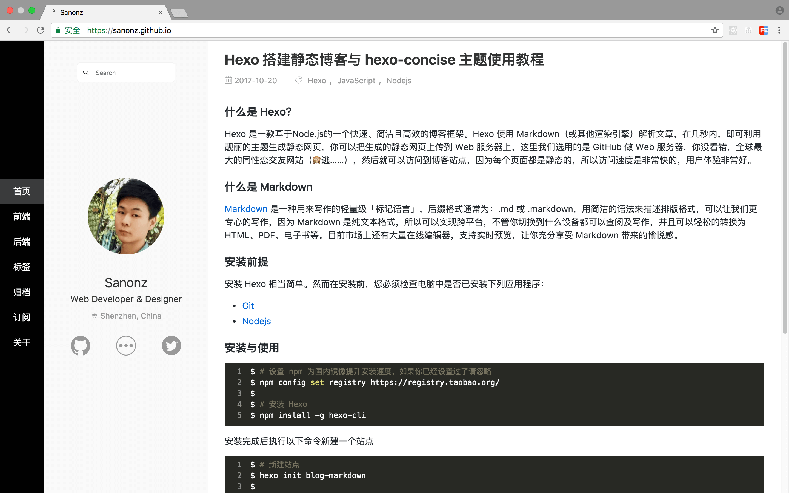

# Concise

Hexo 简约主题，响应式设计支持 PC、手机等设备，代码高亮使用 monokai-sublime 风格，[在线预览](https://sanonz.github.io/)。




### 前提

因为这个主题使用了 less 编译，Hexo 默认的编译器为 [hexo-renderer-stylus](https://github.com/hexojs/hexo-renderer-stylus) 要切换为 [hexo-renderer-less](https://github.com/hexojs/hexo-renderer-less)
```bash
$ npm install hexo-renderer-less --save
```

如果你不需要 `hexo-renderer-stylus` 可以把它卸载掉
```bash
$ npm uninstall hexo-renderer-stylus --save
```

### 安装

``` bash
$ git clone https://github.com/sanonz/hexo-theme-concise.git themes/concise
```

**Concise 主题需要 Hexo 2.4 或者更高的版本**

### 切换

1. 在 `_config.yml` 配置文件中 把 `theme` 值改为 `concise`.
2. 复制 `themes/concise/_config.example.yml` 配置文件为 `themes/concise/_config.yml`

### 更新

``` bash
cd themes/concise
git pull
```

## 配置

修改 `themes/concise/_config.yml` 配置文件

``` yml
# Header
menu:
  首页: /
  前端: categories/front-end
  后端: back-end
  标签: javascript:;
  归档: archives
  订阅: atom.xml
  关于: about

# Content
excerpt_link: 阅读更多

# Sidebar
author:
  name: Sanonz
  work: Web Developer &amp; Designer
  location: Shenzhen, China
  avatar_url: /images/avatar.jpg

links:
  github: https://github.com/sanonz
  more: http://m.timegoto.com/user/1
  twitter: https://twitter.com/sanonze

# Disqus 
disqus:
  enable: true
  shortname: name    #your name
  # count: true

# 友盟统计
umeng:
  prefix: s13
  id: 1234567890
```

- **menu** - 导航列表
- **excerpt_link** - 文章列表阅读更多显示文字
- **sidebar** - 配置博主个人信息，显示在边栏
- **disqus** - 配置评论，需要自行注册 [Disqus](https://disqus.com/) 然后获取 shortname 填写到这里
- **umeng** - 配置站点访问统计，需要自行注册 [Umeng](http://web.umeng.com/main.php?c=user&a=index) 然后获取域名前缀与 ID 填写到这里

可以关闭单个文章的评论，把 `comments` 设置为 `false`，默认为 `true`，例如：
```md
---
title: Hello World
date: 2017-10-20 20:00:00
comments: true
---
```
